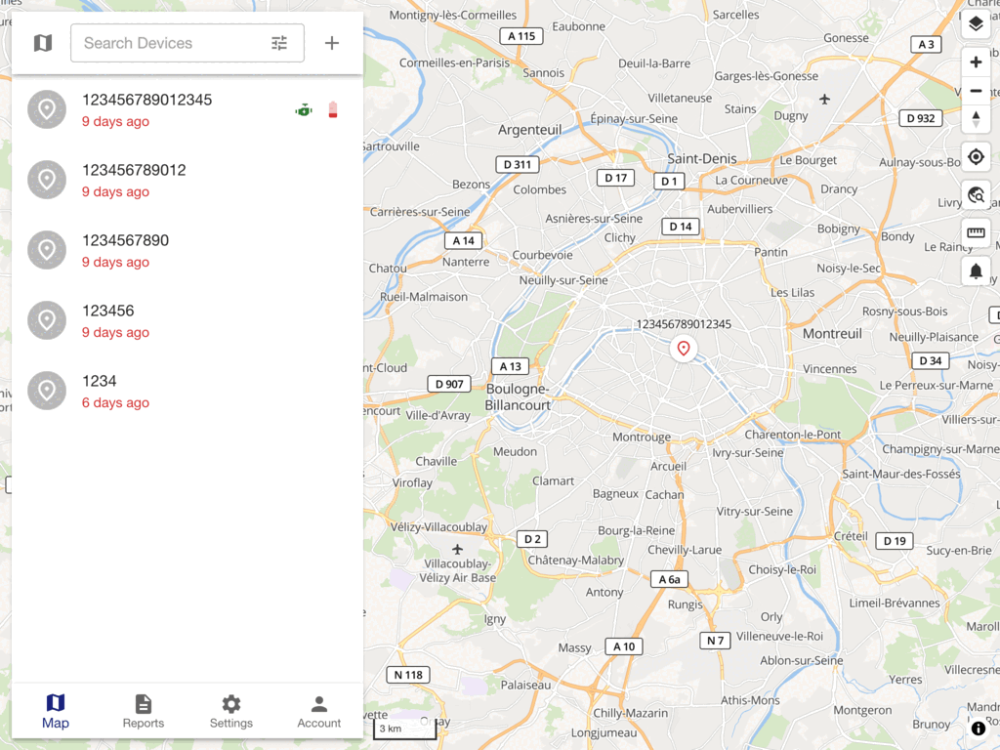

# [Traccar Web App](https://www.traccar.org)

## Overview

This is the browser-based tracking dashboard for [Traccar](https://www.traccar.org), a free and open source GPS tracking platform. It's a React, Material UI, and MapLibre single-page app that talks to the [Traccar server](https://github.com/traccar/traccar) over its REST API, providing the live map, reports, geofences, and device management UI most people mean when they say "Traccar."

This repository is the front-end only. For the back-end server, see the [main Traccar repository](https://github.com/traccar/traccar). You don't need to build this yourself to use Traccar - the server repository already bundles a built copy - this repo is for contributing to or customizing the UI itself.

[Try the live demo](https://www.traccar.org/demo-server/) without installing anything.

| Web Dashboard |
|---|
|  |

## Development

```shell
npm install
npm start
```

This starts a local dev server (Vite) that proxies API requests to a running Traccar server. See the [web app build documentation](https://www.traccar.org/build-web-app/) for full setup details, including how to point it at your own server.

To build a production bundle:

```shell
npm run build
```

## Team

- Anton Tananaev ([anton@traccar.org](mailto:anton@traccar.org))
- Andrey Kunitsyn ([andrey@traccar.org](mailto:andrey@traccar.org))

## License

Apache License, Version 2.0. See [LICENSE.txt](https://github.com/traccar/traccar-web/blob/master/LICENSE.txt) for details.
